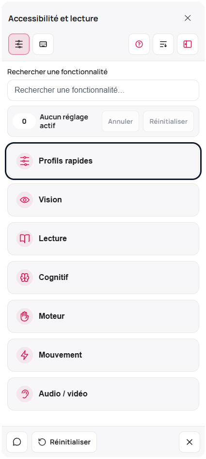

=== MOBLS – Module d’accessibilité ===

Créatrices et mainteneuses : Amandine Bouteloup, Marie Le Bout, Noémie Masclef, Miranda Oger, Gaëlle Sing Ling


Pour favoriser l’accessibilité des sites web, Miranda Oger, Marie Le Bout, Noémie Masclef, Gaëlle Sing Ling et Amandine Bouteloup, cinq étudiantes en master édition numérique et contemporaine sont pionnières du projet “Accessibilité Numérique”, encadré par leur professeur M. Jérôme Legousse. Elles ont donc réussi à développer une extension wordpress, MOBLS, permettant à ses utilisateurs de personnaliser les sites web qu'ils visitent au quotidien. Avec des fonctionnalités très variées, l’extension essaye de prendre en compte tous types de handicap mais permet également un meilleur confort et personnalisation pour une adaptation à tous les utilisateurs. Concrètement, la variation de taille de police, de luminosité ou encore la gestion des contrastes à l’écran, entre autres, rend la navigation plus agréable et naturelle. La révolution de ce projet est qu’il est open source et gratuit, ce qui renforce cette mission d’accessibilité et d'équité du monde numérique.





Tags: accessibility, a11y, widget, comfort, reading
Requires at least: 5.0
Tested up to: 6.6
Stable tag: 1.5.0
License: GPLv2 or later

Module de personnalisation d’accessibilité et de confort de lecture. Le widget propose des réglages visuels, cognitifs, moteurs, de lecture audio et de démonstration braille visuelle. Il ne remplace pas un audit RGAA/WCAG, un lecteur d’écran, une plage braille ni une correction structurelle du site.

== Avertissement important ==
Ce plugin aide les utilisateurs à adapter l’affichage et certains comportements de la page. Il ne garantit pas la conformité RGAA/WCAG d’un site. La conformité dépend du contenu, de la structure HTML, des contrastes, des alternatives textuelles, de la navigation clavier, des formulaires, des médias et des tests réalisés sur les pages réelles.

== Nouveautés 1.5.0 ==
- Ajout d’une carte d’état d’intégration `RGAA_Audit` dans l’administration du widget.
- La carte indique si l’application compagnon est détectée, sa version si disponible, le lien administrateur et le mode de liaison.
- Le périmètre reste séparé : `RGAA_Audit` conserve les critères, preuves, anomalies, rapports et statuts de conformité ; le widget reste une aide de confort et de suivi synthétique.
- Amélioration du suivi des retours utilisateurs : vue détail, note interne privée, lien manuel vers `RGAA_Audit` et export CSV avec colonne de note.
- Stabilisation des profils : état actif lié aux réglages réellement actifs, état partiel, désactivation ciblée du profil courant et nettoyage du profil mémorisé lors du reset global.
- Ajout d’un import/export JSON de configuration admin, sans retours utilisateurs ni données détaillées `RGAA_Audit`.
- Ajout d’un diagnostic local `Santé du widget`, sans télémétrie externe ni lecture des critères `RGAA_Audit`.
- Ajout d’une page admin `Crédits`, liée depuis `Audit et suivi`, pour afficher les créatrices et le cadre du projet MOBLS.
- Densification responsive du panneau : raccourcis guidés plus compacts sur écrans étroits ou peu hauts, scroll interne contenu et infobulles d’icônes stabilisées.
- Passage des raccourcis clavier en fenêtre superposée ancrée au côté du panneau, et rangement du glossaire dans `Aide et tutoriels`.
- Ajout d’une fermeture explicite à la vue `Structure de page` pour revenir au panneau principal.
- Ajout d’un assistant de configuration admin pour régler le mode d’ouverture, le périmètre visible, la déclaration publique et les retours sans mélanger le widget avec `RGAA_Audit`.
- Ajout d’un sous-menu `Profils de confort` pour activer, renommer et composer les profils rapides affichés dans le panneau.
- Ajout de la recherche dans `Aide et tutoriels`, suppression du bloc redondant `Démarrer avec` et clarification des profils rapides comme points de départ.
- Regroupement de `Retour utilisateur` et des informations publiques dans une icône de pied de panneau, avec fermeture par croix nommée et infobulles non coupées.
- Ajout de favoris utilisateur limités à cinq réglages, d’une action `Annuler` pour le dernier changement et d’une recherche enrichie par synonymes d’usage.
- Ajout d’une visionneuse Braille d’exemple améliorée dans les cartes de braille visuel : copie, points agrandis et fenêtre détachable, sans support de plage braille matérielle.
- Affichage des créatrices de l’application dans une carte dédiée de `Retours et informations`, séparée de la déclaration publique.
- Ajout d’un test visuel Playwright optionnel couvrant le panneau, les favoris et la visionneuse braille sur plusieurs tailles d’écran.

== Nouveautés 1.4.6 ==
- Remplacement de la fenêtre didactique centrée sur la luminosité par une fenêtre « Aide et tutoriels » structurée.
- Ajout de six rubriques pédagogiques : prise en main, choix selon le besoin, catégories du module, clavier et raccourcis, données et limites, démo et administration.
- Ajout de cartes de besoins fréquents pour aider l’utilisateur à choisir un réglage sans diagnostic ni promesse excessive.
- Ouverture par défaut de la première rubrique et du premier panneau pour donner un point d’entrée immédiat.
- Clarification des raccourcis : ils sont contextualisés au panneau ouvert pour limiter les conflits avec le navigateur et les technologies d’assistance.
- Ajout d’explications sur ce que le widget peut modifier et sur ce qu’il ne peut pas corriger : conformité RGAA/WCAG, structure HTML, lecteur d’écran, plage braille, sécurité visuelle.
- Les textes du guide privilégient des formulations de confort, de personnalisation et de réduction d’exposition, sans promesse de correction automatique.

== Nouveautés 1.4.5 ==
- Alignement de l’administration avec une interface plus sobre, plus proche de l’esprit WordPress 7.0 : cartes neutres, couleurs d’administration WordPress, bordures simplifiées, moins de gradients et moins d’ombres.
- Ajout d’un bloc « Personnalisation visuelle » dans les options du widget : thème MOBLS, thème WordPress neutre ou couleurs personnalisées.
- Les couleurs configurables couvrent la couleur principale, le texte sur couleur principale, les surfaces, le texte, le texte secondaire et les bordures.
- Ajout d’un réglage de rayon des coins du panneau, limité pour préserver la lisibilité.
- Le nom de l’application et le menu principal restent inchangés.
- Renommage prudent de la catégorie « Épilepsie » en « Mouvement et flashs », tout en conservant les slugs techniques existants pour éviter les ruptures de compatibilité.
- Ajout d’une prise en compte explicite de `prefers-reduced-motion` dans l’administration.

== Nouveautés 1.4.4 ==
- Ajout d’un protocole de recette complet dans `TESTING.md` : installation, clavier, modal, lecteur d’écran, responsive, reset, shortcode, modules et critères de blocage release.
- Ajout d’un guide de démo WordPress dans `docs/DEMO_WORDPRESS.md`, pensé pour le kit de démonstration séparé.
- Ajout d’un document de positionnement dans `docs/POSITIONNEMENT_ACCESSIBILITE.md` afin d’éviter les formulations trompeuses ou redondantes avec les technologies d’assistance.
- Aucun ajout IA : la version reste centrée sur la recette, la démonstration et la stabilisation.
- Cette version ne modifie pas la logique front du widget ; elle prépare la recette WordPress réelle et le peuplement de démonstration.

== Nouveautés 1.4.3 ==
- Renforcement du comportement modal : isolement des contenus hors widget, restauration de l’état `overflow` du document et récupération du focus si celui-ci sort du panneau en mode modal.
- Suppression du gestionnaire de clic global redondant qui doublonnait les actions d’ouverture/fermeture du panneau.
- Clarification des libellés du module migraine : vocabulaire de confort visuel et d’atténuation, sans promesse de soulagement ou de protection.
- Renommage de l’aide « Aria » en « Raccourcis » pour éviter de confondre ARIA et raccourcis clavier.
- Raccourcis clavier limités au panneau ouvert afin de réduire les conflits avec le navigateur et les technologies d’assistance.
- Correction sémantique dans l’administration : le choix du logo du lanceur utilise des boutons radio, car une seule variante peut être active.
- Ajout explicite de `type="button"` sur les boutons front qui ne soumettent aucun formulaire.

== Nouveautés 1.4.2 ==
- Correction du bouton « Réinitialiser » : toutes les préférences de modules sont désormais effacées ou remises à leur état par défaut, y compris épilepsie, braille, synthèse vocale, migraine, dyslexie, luminosité, curseur, boutons, guide de lecture, daltonisme, position du lanceur et position de la fenêtre d’information.
- Correction du clic sur l’overlay en mode modal : l’arrière-plan peut de nouveau fermer le panneau lorsque ce comportement est attendu.
- Correction du shortcode `[a11y_widget]` : il passe par le même garde-fou que l’injection automatique afin d’éviter deux instances du widget sur une même page.
- Correction de la recherche interne : le résultat « Daltonisme » conserve maintenant son interface spécialisée au lieu de retomber sur un groupe générique.
- Correction de la fenêtre d’information : les préférences sont décrites comme stockées en `localStorage`, et non dans des cookies.
- Reformulation du module épilepsie : suppression des promesses de protection et du vocabulaire de danger garanti au profit d’un vocabulaire de réduction de déclencheurs visuels potentiels.
- Repositionnement de la synthèse vocale : le module est présenté comme une lecture audio de confort, pas comme un lecteur d’écran.
- Repositionnement du braille : le module est présenté comme une démonstration visuelle en caractères braille Unicode, pas comme un support de plage braille.
- Renommage de l’administration : retrait de l’intitulé « Accessibilité RGAA » pour éviter de suggérer une conformité automatique.
- Réduction des valeurs de `z-index` extrêmes pour limiter les conflits avec les thèmes et extensions.

== Nouveautés 1.4.1 ==
- Retrait du mode « Monophtalmie » du widget a11y.

== Nouveautés 1.4.0 ==
- Arrivée du mode « Monophtalmie » intégrant une loupe activable, des indicateurs de profondeur, un champ visuel adaptable et un mode vision basse dédié.

== Nouveautés 1.3.0 ==
- Nouveau mode « Soulagement migraines » avec filtre ambré, suppression des motifs répétitifs, espacement augmenté et 4 presets rapides.

== Nouveautés 1.2.0 ==
- Nouvelle page d’administration « Accessibilité » permettant de masquer certaines fonctionnalités du module pour les utilisateurs finaux.
- Interrupteurs désactivés côté admin retirés automatiquement du widget côté visiteurs.

== Nouveautés 1.1.0 ==
- Sections du widget générées dynamiquement.
- Ajout d’un répertoire `features/` qui accepte des fichiers Markdown (`.md`). Chaque fichier peut définir une section et des interrupteurs supplémentaires sans écraser ceux fournis par défaut.
- Les slugs déjà utilisés sont ignorés pour éviter les collisions avec les fonctionnalités existantes.

== Utilisation ==
1. Uploadez le dossier `a11y-widget` dans `wp-content/plugins/`.
2. Activez le plugin.
3. Par défaut, le widget s’affiche en bas à droite de toutes les pages via `wp_footer`.

- Shortcode : `[a11y_widget]` pour l’afficher à un emplacement précis.
- Désactiver l’injection automatique dans `functions.php` :
  `add_filter( 'a11y_widget_enable_auto', '__return_false' );`

== Personnalisation visuelle ==
Dans l’administration WordPress, le menu « Accessibilité » contient maintenant un bloc « Personnalisation visuelle ». Il permet de conserver l’identité MOBLS, de basculer vers un rendu WordPress neutre ou de définir des couleurs personnalisées. Ces réglages modifient uniquement les variables CSS du widget côté site ; ils ne corrigent pas les contrastes ou défauts structurels du thème WordPress.

== Documentation de recette et de démonstration ==
- `TESTING.md` : protocole de recette complet.
- `docs/DEMO_WORDPRESS.md` : création et peuplement d’un WordPress de démonstration avec le kit séparé.
- `docs/POSITIONNEMENT_ACCESSIBILITE.md` : formulations recommandées, limites et redondances avec les technologies d’assistance.
- `docs/ARCHITECTURE_COMBO_RGAA_AUDIT.md` : séparation des responsabilités entre le widget et l’application compagnon RGAA_Audit.

== Ajouter des fonctionnalités via Markdown ==
1. Créez si besoin le dossier `wp-content/plugins/a11y-widget/features/`.
2. Ajoutez un fichier `mon-profil.md` en respectant le format suivant :

```
# Titre de ma section
- `mon-slug` **Nom lisible** : Indice/description optionnel.
- `autre-slug` **Autre fonctionnalité** : Texte d’aide.
```

Chaque fichier peut contenir plusieurs sections (`#`). Les slugs déjà utilisés par le widget de base ou par un autre fichier sont ignorés pour éviter les doublons. Vous pouvez ensuite brancher vos scripts/styles sur les attributs `data-*`, l’API JavaScript ou les CustomEvents.

== API ==
- `window.A11yWidget.registerFeature('mode-nuit', fn)` – écoute les bascules.
- `window.A11yWidget.get('mode-nuit')` – lit l’état.
- `window.A11yWidget.set('mode-nuit', true)` – définit l’état et persiste la préférence.

Chaque toggle applique ou retire un attribut `data-*` sur `<html>`, par exemple `data-a11y-mode-nuit="on"`. Branchez vos règles CSS globales selon ces attributs, ou réagissez en JavaScript.

== Données et préférences ==
Les préférences utilisateur sont enregistrées dans le navigateur via `localStorage`. Elles ne sont pas envoyées au serveur par ce module. Le bouton « Réinitialiser » supprime les préférences enregistrées par le widget.

== Sécurité et accessibilité du widget ==
- Panneau avec rôle `dialog`, `aria-modal`, fermeture par Échap, piège du focus, isolement des contenus hors widget et restauration du focus en mode modal. Les raccourcis de fonctionnalités ne sont actifs que lorsque le panneau est ouvert.
- Mode interactif possible si l’administrateur souhaite laisser la page manipulable derrière le panneau.
- Les fonctions de confort ne remplacent pas les technologies d’assistance natives ni un site correctement balisé.

== Limitations connues ==
- La lecture à voix haute repose sur la synthèse vocale du navigateur. Elle ne fournit pas les rôles, états, landmarks, tableaux, formulaires ou erreurs comme le fait un lecteur d’écran.
- Le braille affiché est une transcription visuelle Unicode. Il ne pilote pas une plage braille matérielle.
- Le module épilepsie réduit certains déclencheurs visuels potentiels, mais ne constitue pas un dispositif médical.
- Le module migraine/confort visuel propose des réglages d’atténuation. Il ne constitue pas un avis médical et ne garantit pas de soulagement.
- Les polices spécialisées ne sont plus chargées automatiquement depuis des sources distantes. Si elles ne sont pas disponibles localement sur le poste utilisateur, le navigateur utilise les polices de repli.

== Documentation intégrée ==
- `TESTING.md` : protocole de recette.
- `docs/DEMO_WORDPRESS.md` : guide de démo WordPress.
- `docs/POSITIONNEMENT_ACCESSIBILITE.md` : limites et formulations recommandées.
- `docs/ARCHITECTURE_COMBO_RGAA_AUDIT.md` : contrat de liaison avec RGAA_Audit.
- `docs/WORDPRESS_UI_EXPERIMENT.md` : piste expérimentale `@wordpress/ui` / `@wordpress/admin-ui`.
- `docs/WORDPRESS_ACCESSIBILITY_INTEGRATIONS.md` : pistes d’intégration WordPress autour de l’accessibilité.
